  

<h2 align="center">Hey! I'm Giovanni</h2>
 
<table cellspacing="0" cellpadding="0" border="0">
  <tr>
    <td>
     I’m a Junior Software Developer with 1 year of professional experience, currently working at a company within the Volaris group, where I maintain and improve systems across the .NET ecosystem. My work focuses on system maintenance, performance optimization, and continuous improvements that generate real results, including better scalability, cleaner code, and cost savings for the team.

I have solid experience with React and the core web stack (JavaScript, HTML, CSS), working on web applications and integrations with back-end services. I’ve also developed RESTful APIs to support digital business processes and server management, including systems that handle high volumes of data, always prioritizing performance, reliability, and clean architecture.
    </td>
  </tr>
</table>
 

###

 

🤖 Languages and frameworks

  

    <!-- Linha 1 -->
    
    
    
    
    
    
    
    
    
  

  

    <!-- Linha 2 -->
    
    
    
    
    
    
    
    
    
  

##
